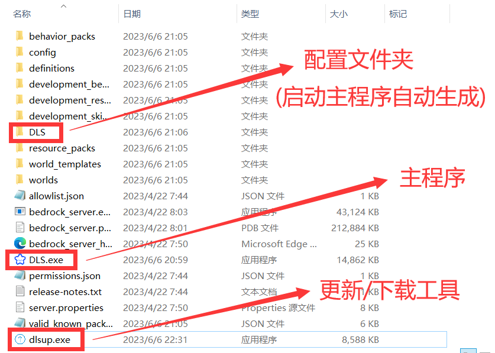

## 安置文件

如图，下载的更新程序dlsup.exe放入bds根目录，运行下载主程序DLS.exe(中途按Enter确定)

（你可以在 [dlsup发行版](https://gitee.com/dlcn/dlsup/releases) 或群文件下载到更新程序）

(若更新程序出现问题可前往[dls发行版](https://gitee.com/dlcn/dlscq/releases)自行下载)



## 配置DLS

### 配置文件

打开DLS配置文件夹，您将看到这些json文件

(详细的配置说明请参考[配置解释](04.md))


### 安装机器人框架

**（以下为go-cqhttp框架使用说明，dls也支持其他onebot标准框架，如 [onebots](https://gitee.com/dlcn/dlscq/wikis/%E7%89%B9%E6%AE%8A%E6%93%8D%E4%BD%9C/onebots%E6%9C%BA%E5%99%A8%E4%BA%BA%E6%A1%86%E6%9E%B6) ）**

Windows

1.点击[下载cqhttp整合包，下载后解压](https://gitee.com/dlcn/dlscq/releases/download/ws1.9.8/cqhttp.zip)

2.准备一个用于机器人的QQ号(一般创建个小号)

3.打开go-cqhttp内的config.yml文件，如下图填入账号和密码

4.双击 go-cqhttp.bat 运行cqhttp程序即可
  * 若提示需要验证，选择1自动提交，复制链接在浏览器打开滑块验证即可
  * 新建的小号建议挂到3级再登机器人，否则很容易被风控


Linux请前往 [go-cqhttp发行版（指向github）](https://gitee.com/link?target=https%3A%2F%2Fgithub.com%2FMrs4s%2Fgo-cqhttp%2Freleases) 下载最新版本，提示选择协议时输入2(正向Websocket)

Windows用户若要自行下载，前往其发行版下载 go-cqhttp_windows_amd64.exe 运行

**如有登录异常问题 [点击此处查看](https://gitee.com/dlcn/dlscq/wikis/%E5%BF%AB%E9%80%9F%E5%90%AF%E5%8A%A8/%E5%B8%B8%E8%A7%81%E9%97%AE%E9%A2%98)**

### 配置机器人

打开文件: ***机器人配置.json***

```
{
  "启用机器人": true,
  "机器人地址": "127.0.0.1",
  "机器人端口": 8080,
  "access-token": "WERTYUIO",
  "管理员QQ号": [2021583736, 1234567890],
  "管理QQ群号": 531241108
}
```

* 机器人地址：填cqhttp所在的服务器的地址，如果cqhttp和dls在同一台电脑，填`127.0.0.1`，如果cqhttp在内网的另一台电脑，例如该电脑的地址是`192.168.114.51`，就填这台电脑的地址
* 机器人端口：填cqhttp的`config.yml`中的`servers/ws/address`中的端口
* access-token: 填cqhttp的`config.yml`中的`default-middlewares/access-token`中的内容。这是用于cqhttp验证的凭据，只有凭据相同的进程才能够连接cqhttp。如果你的机器人使用的端口是开放在公网环境的，为确保安全，强烈建议修改此项，但要与cqhttp文件夹内`config.yml`中配置的`access-token`保持一致
* 管理员QQ号：您指派的拥有使用非“全员可用”命权限的QQ号。
* 管理QQ群号：和机器人在QQ上交互使用的QQ群号

***重点: 管理员QQ号、管理QQ群号修改为自己的***

### 修改机器人命令和正则

***启用"绑定白名单"命令***

群员可用此命令绑定QQ号与游戏内玩家名，方便白名单管理

因为不是所有人都需要，所以默认是关闭的

启用此命令你需要: 打开文件 `机器人命令.json`

找到"`绑定白名单`"相关的配置，将 `限制次数` 的值改为1

配置示例:

```
{
      "识别头": "绑定白名单",
      "执行命令": "cmd whitelist add \"%p\"",
      "记录": "bindWl",
      "限制次数": 1,
      "全员可用": true,
      "退群重置": true,
      "退群触发": "cmd whitelist remove \"%r\""
},
```

修改`机器人命令.json`和`机器人正则.json`，具体参见 ***[📑 配置解读](3.md)***

* 如果您的服务端是Bedrock Dedicated Server及其分支，您可以直接前往“如何启动”章节，因为DLS默认给出了此服务端的配置。
* 如果您的服务端安装了会改变bds输出内容的插件（如称号插件或汉化插件），您需要阅读“配置解释（选读）/机器人正则.json”章节并根据实际情况修改正则。
* （安装了LiteLoaderBDS加载器的BDS仍然是BDS）
* 如果您的服务端是其他已测试的服务端，您可以在“配置命令和正则”中找到针对您使用的服务端的修改指南。
* 如果您没有找到对应的指南，或您的服务端并未经过测试，请前往 ***[💻 特殊操作](2.md)*** 的`通过DLS管理其他命令行`板块。

关于`机器人命令.json`和`机器人正则.json`的解释位于 ***[📑 配置解读](3.md)*** 。仅在需要增加自定义功能时，您才需要阅读这些章节。

### 配置命令和正则

如果您的服务器是bds或liteloaderbds，您可以直接前往“如何启动”章节。如果您的服务器不在已测试的服务端列表内，请参阅 ***[📑 配置解读](3.md)*** 。仅在需要增加自定义功能时，您才需要阅读这些章节。

如果您的服务端安装了会改变聊天信息内容的插件（如称号插件），您需要阅 ***[📑 配置解读](3.md)*** 章节中的`机器人正则.json`分支并根据实际情况修改正则。

#### Vanilla、Bukkit及其分支（Spigot、Paper等）、Sponge

打开”`机器人命令.json`“，并 **修改** 对应的内容：

```
{
      "识别头": "添加白名单",
      "执行命令": "cmd whitelist add %p"
    },
    {
      "识别头": "移除白名单",
      "执行命令": "cmd whitelist remove %p"
    },
    {
      "识别头": "绑定白名单",
      "执行命令": "cmd whitelist add %p",
      "记录": "bindWl",
      "限制次数": 0,
      "全员可用": true,
      "退群重置": true,
      "退群触发": "cmd whitelist remove %r"
    },
    {
      "识别头": "chat",
      "执行命令": "chatJava [§2群聊§f] <§6%n§f> %p",
      "全员可用": true
    }
```

打开”`机器人正则.json`“，并添加以下内容：

```
{
      "正则": "(.+)INFO(.+): There are(.+)of a max of(.+)players online:(.+)",
      "返回消息格式": "当前有%s3个玩家在线:%s5,最多可以有%s4个玩家同时在线"
    },
    {
      "正则": "(.+)INFO(.+):(.+)joined the game",
      "返回消息格式": "%s3进入了服务器"
    },
    {
      "正则": "(.+)INFO(.+):(.+)left the game",
      "返回消息格式": "%s3退出了服务器"
    },
    {
      "正则": "\\[Not Secure] <(.+)> -(.+)",
      "返回消息格式": "%s1: %s2"
    }
```

如果您的服务器是正版服（开启正版验证：`online-mode=true`），`"正则": "\\[Not Secure] <(.+)> -(.+)`"请去掉"`[Not Secure]`"。

#### PowerNukkitX（中文）

打开”`机器人正则.json`“，并替换整个文件为以下内容：

```
{
  "正则匹配": [
    {
      "正则": "(?<=\\[DLS]\\[INFO]).+",
      "返回消息格式": "%s",
      "过滤列表": []
    },
    {
      "正则": "\\[INFO ] 目前有(.+)个玩家在线",
      "返回消息格式": "当前有%s个玩家在线:",
      "输出追加行数": 1
    },
    {
      "正则": "\\[INFO ] (.+) 加入了游戏",
      "返回消息格式": "%s进入了服务器"
    },
    {
      "正则": "\\[INFO ] (.+) 加入了游戏",
      "返回消息格式": "%s退出了服务器"
    },
    {
      "正则": "\\[INFO ] <(.+)> (.+)",
      "返回消息格式": "%s1: %s2"
    },
    {
      "正则": "(?<=Unknown command: ).+?(?=\\.)",
      "返回消息格式": "未知命令: %s"
    },
    {
      "正则": "(?<=Syntax error: ).+",
      "返回消息格式": "格式错误: %s"
    },
    {
      "正则": "\\[INFO ] 用法：",
      "返回消息格式": "后台提示“用法：”，可能是指令格式错误"
    },
    {
      "正则": "\\[INFO ] 已将 (.+) 设为管理员",
      "返回消息格式": "成功给予 %s 管理员权限"
    },
    {
      "正则": "\\[INFO ] 已夺去 (.+) 的管理员权限",
      "返回消息格式": "成功取消 %s 管理员权限"
    },
    {
      "正则": "(?<=Could not op \\(already op or higher\\): ).+",
      "返回消息格式": "玩家 %s 已是管理员"
    },
    {
      "正则": "\\[INFO ] 没有与选择器匹配的目标",
      "返回消息格式": "没有与选择器匹配的目标"
    },
    {
      "正则": "\\[INFO ] 已将 (.+) 加入允许列表",
      "返回消息格式": "已将 %s 加入允许列表"
    },
    {
      "正则": "\\[INFO ] 已将 (.+) 移出允许列表",
      "返回消息格式": "已将 %s 移出允许列表"
    },
    {
      "正则": "\\[INFO ] 游戏规则 (.+) 已更新为 (.+)",
      "返回消息格式": "游戏规则 %s1 已更新为 %s2"
    }
  ]
}
```

### 如何启动

#### 1. 启动机器人

如果配置好了cqhttp机器人，双击cqhttp.bat启动程序

**注意：使用bat文件启动，而不是exe文件**

#### 2. 启动DLS程序

***注意：配置好后DLS会为你启动服务端***

***你不再需要运行原来的服务端程序了***

***如果仍然直接运行原来的服务端，则机器人不会启动***

最后，保证cqhttp和DLS同时运行即可。

在群里发送 DLS帮助 查看可用的机器人命令

*(当DLS运行时，修改配置文件保存后，可用dlsload命令重载配置，无需重启)*

***(完整功能请参考 [📑 配置解读](3.md) )***

#### 群命令介绍：

*(其中...替换为指定消息内容。qq代表指定qq号，也支持@成员的形式)*

```
开服 -> 启动服务器
关服 -> 关闭服务器
在线人数 -> 查看在线成员(全员)
cmd <命令内容> -> 执行服务器指令
添加白名单 <玩家名> -> 添加玩家白名单
移除白名单 <玩家名> -> 移除玩家白名单
绑定白名单 <玩家名> -> 添加玩家白名单(全员,限制次数)
移除绑定 qq -> 移除指定qq号的绑定记录
查询绑定 qq -> 查询指定qq号的绑定
chat <消息内容> -> 发送消息至服务器(全员)
服务器状态 -> 硬件使用情况(全员)
查服 <地址> -> 基岩版motd查询(全员)
查云黑 <qq号或玩家名> -> 云黑查询(全员)
查xuid <玩家名> -> 根据id查xuid(全员)
清理记录 -> 清理退群成员记录并执行设定的触发命令
立即备份 -> 立即关服备份并重启
重载配置 -> 重载机器人配置文件
```
