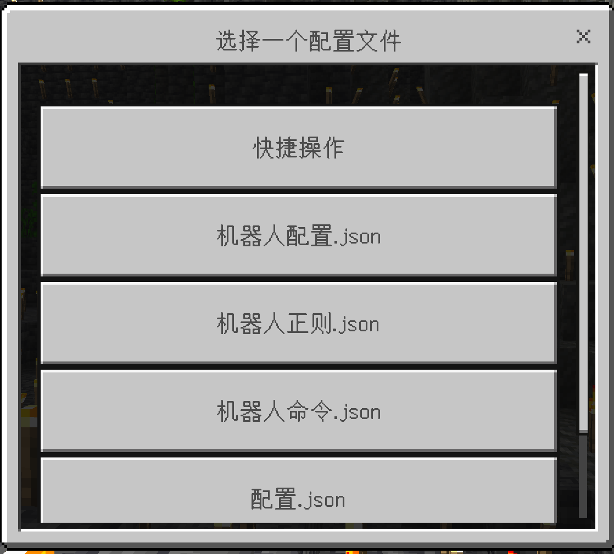
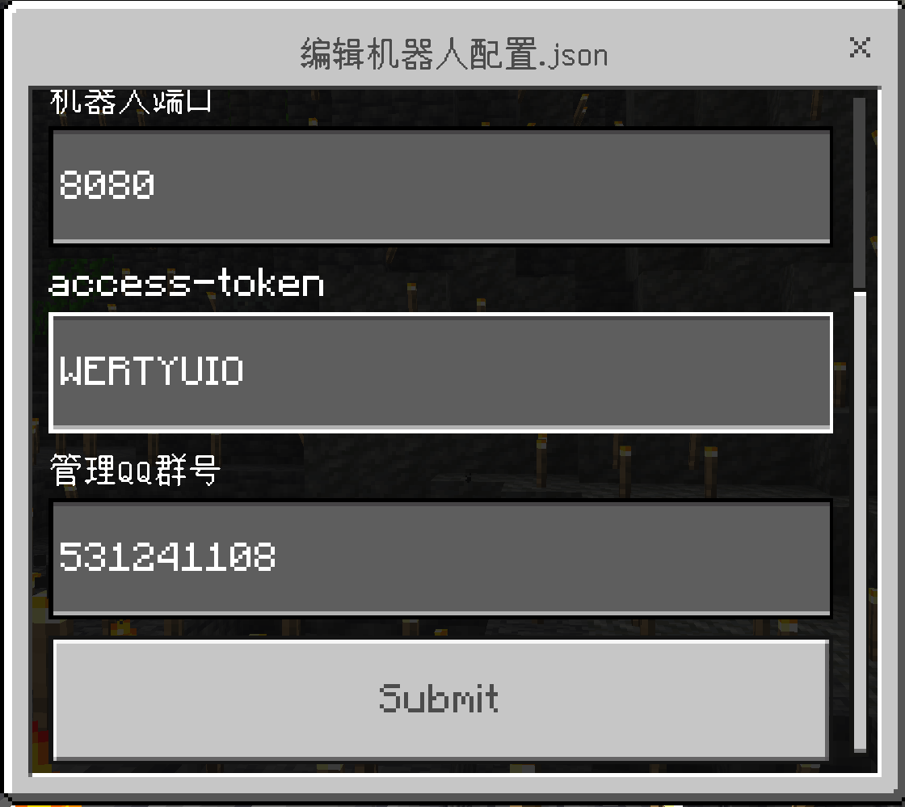
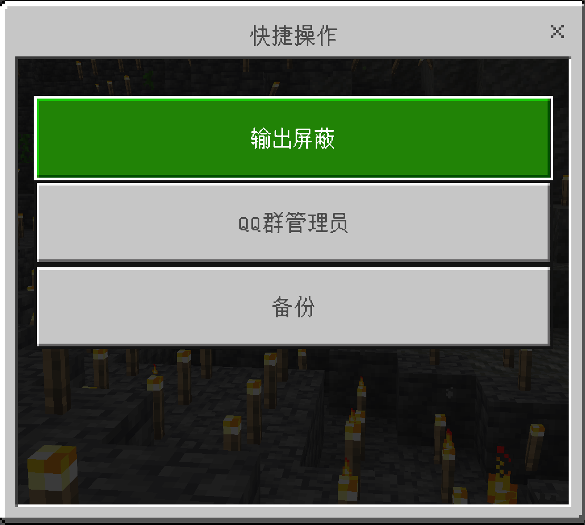
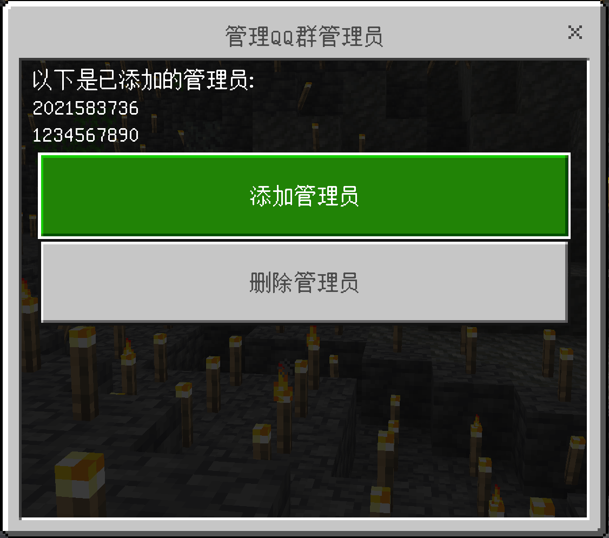
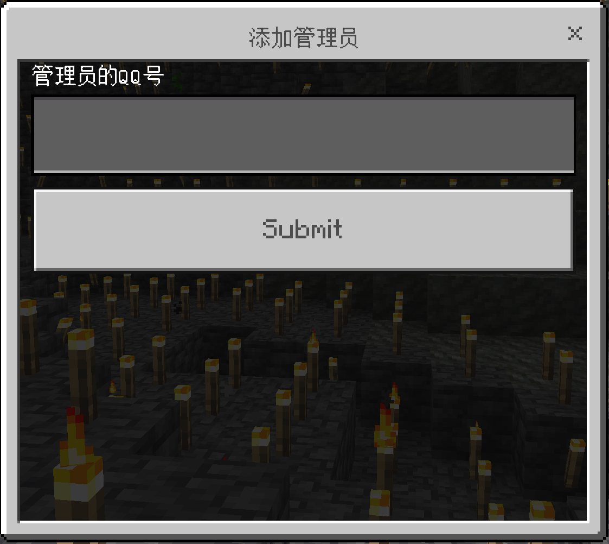

## 转发所有群消息

有些人希望自动将所有消息转发到游戏内，而不使用chat前缀

这里给出了实现方案:

首先，在 `机器人命令` 内，把chat那一条的识别头改为""，如下:

```
{
      "识别头": "",
      "执行命令": "chat [§2群聊§f] <§6%n§f> %p",
      "全员可用": true
},
```

即空字符串，其他内容保持不变，这样所有的消息都会识别并转发

其次删除掉 `机器人正则` 内的" *没有匹配的对象* "那一整条，即如下整个内容:

```
{
      "正则": "No targets matched selector",
      "返回消息格式": "没有匹配的对象"
},
```

这是因为服里没人的时候使用tellraw指令会报这个错，所以不让报错转发到群里

不过控制台还是会有这些报错，如果你觉得还不够。

可以在 `配置` 里的输出屏蔽中，加入No targets matched selector，即:

```
"输出屏蔽": ["Running AutoCompaction...", "No targets matched selector"]
```

## 多服聊天消息互通

### 配置服务端

首先为每个服启用广播服务，在 `配置.json` 中指定 `服务端口` 和 `服务token`

```
{
  "程序版本": "ws1.9",
  "开服命令": "bedrock_server.exe",
  "崩溃重启": true,
  "输出屏蔽": [
    "Running AutoCompaction...",
    "\\[DLSConfigEditor] dlsload"
  ],
  "服务端口": 4999,
  "服务token": "123456",
  "描述": "DLS基本的配置项在此处修改"
}
```

#### 注意事项

目前大多数API服务的配置错误都无法被DLS捕获并提示，因此出现问题时， **请务必仔细阅读文档** ，与自己的配置和操作方式比对查找原因

同一主机上每个DLS **端口不能相同** ，否则将出现端口冲突

修改此配置后，请重启DLS才能使配置生效， ***dlsload命令无法对这些配置项重载***

服务token中请不要使用 **@** 符号，这将导致无论如何都无法验证token

### 配置客户端

在 `机器人正则.json` 中为Chat相关正则指定 **广播地址** 和 **广播格式**

```
{
      "正则": "\\[Chat] <(.+)> (.+)",
      "执行命令": "group %s1: %s2",
      "广播地址": "127.0.0.1:4999@123456",
      "广播格式": "[B]%p"
},
```

### 广播地址

写法为 ***地址:端口@token***

填写互相的地址，A服中正则填写B服地址，B服中正则填写A服地址

目前不支持IPv6和域名，有相关需求请使用代理

如果需要同时向两个及以上DLS广播，请设置多个条相同正则并使用不同地址

### 广播格式

可用 **%p** 占位符代表源文本，示例为加入了[B]前缀

为每个服使用自己的前缀方便后续处理

### 处理消息

配置成功后，服务器将收到向它广播的DLS发送的消息，并将其显示在控制台。例如B服匹配到了输出`[Chat] <Amouseeeeeeeeee> 114514`,并根据正则向A服发送了`[B][Chat] <Amouseeeeeeeeee> 114514`,B就会在控制台输出内容`[A][Chat] <Amouseeeeeeeeee> 114514`。

B服收到的消息同样可以通过正则匹配到，例如如果需要将A这条消息发送至服务器内，可以进行如下配置：

```
{
      "正则": "\\[B][Chat] <(.+)> (.+)",
      "执行命令": "chat [B]<%s1> %s2"
},
```

玩家将在服务器内看到这样一条消息：`[B]<Amouseeeeeeeeee> 114514`

在两个服务器中进行反方向的配置，即在A服中配置广播，并在B中匹配A的广播消息，即可实现双向的聊天互通

## 配置外置DLS插件

> ⚠该功能正在开发中，目前暂不支持

请阅读《配置和编写外置DLS插件》

## onebots机器人框架

你也可前往 **[onebots仓库](https://gitee.com/link?target=https%3A%2F%2Fgithub.com%2Flc-cn%2Fonebots%2Fblob%2Fmaster%2FREADME.md)** 了解如何安装此框架

( **我们推荐你使用go-cqhttp框架，仅在无法使用时尝试onebots框架** )

### 安装nodejs环境

自行搜索安装nodejs，若在下一步安装过程中出错，你很可能需要给npm更换国内源,更换国内源请自行查找教程`npm更换国内源`

### 使用命令安装

```
npm install -g onebots
```

### 生成配置文件

选项一：配置文件存到(用户目录/.onebots/config.yaml)

选项二：配置文件存到当前目录

```
onebots -c config.yaml
```

### 编辑配置文件

在指定位置修改账号(密码不需要)，并将platform项改为3(手表协议)

你可以设置端口，token等信息，与go-cqhttp类似

### 启动程序

使用你在生成配置文件时选择的命令来启动程序

第一次启动你还需要扫码登录

### DLS机器人配置

以下为示例配置，尤其注意onebots框架ws连接实际为 **ws://127.0.0.1:6727/<qq号>**

所以在设置好端口和token后，你还需要修改连接节点为`/<机器人qq号>`

```
{
  "启用机器人": true,
  "机器人地址": "127.0.0.1",
  "机器人端口": 6727,
  "连接节点": "/1667047824",
  "access-token": "WERTYUIO",
  "管理员QQ号": [
    2021583736,
    1234567890
  ],
  "管理QQ群号": 531241108,
  "描述": "QQ机器人相关的配置项在此处修改"
}
```

## 通过DLS管理其他命令行（Waterfall等代理端、泰拉瑞亚等）

**请注意，不能保证DLS在未经测试上运行时的稳定性。如果您需要一个稳定的机器人管理工具，尤其是在开放的服务器上使用DLS，建议您寻找其他的管理工具。DLS开发团队不对任何因使用未经测试的命令行工具而出现的任何后果负责。**

#### 原理

以下是本操作的原理。如果您需要进一步利用DLS管理您的各类命令行，您需要阅读此章节，以便您可以灵活地针对您的程序进行配置。

dls其实就是一个命令行程序的输入输出处理工具。在`机器人命令.json`中，cmd命令即是向命令行中发送指令的命令；在`机器人正则.json`中，DLS在获取命令行中输出的内容后，将其与正则进行匹配，进而决定是否进行某个指令。因此可以理解为，`机器人命令.json`中的cmd命令是在QQ群中向命令行中输出命令，而`机器人正则.json`则是匹配命令行输出的内容，经过正则的处理后发送到QQ群。

因此，您需要修改机器人命令中的cmd以及机器人正则中的正则，来让它们能够在您指定的命令行工具中正常运作。

## 群组服广播玩家进出服务器 - 将DLS部署在代理端

在群组服中，如果将DLS进出服务器正则仅部署在登录服，则会出现玩家传送到其他子服时，机器人提示退出服务器的情况。

而如果将DLS进出服务器正则部署在所有子服，则会出现玩家在服务器间传送时，机器人提示玩家退出再进入服务器的情况。

如果DLS在登录服仅部署了进入服务器正则，确实可以实现玩家传送时不提示的情况。

如果需要仅在玩家进入和退出服务器时提示，而不在玩家传送时提示，可以将DLS部署在代理端。

以BungeeCord为例，先将DLS安装在`BungeeCord`中。

打开`机器人正则.json`,添加以下内容：

```
    {
      "正则": "\\[信息] \\[(.+)] <-> ServerConnector \\[(.+)] has connected",
      "返回消息格式": "%s1进入了服务器"
    },    
    {
      "正则": "\\[信息] \\[(.+)] <-> DownstreamBridge <-> \\[(.+)] has disconnected",
      "返回消息格式": "%s1退出了服务器"
    },
```

## 多个DLS同时管理一个命令行(九转DLS，谨慎进入😂)

*首先，你是故意的还是不小心？是……故意的👻*

如果需要同时在多个群内管理DLS，则需要将多个DLS嵌套，一个DLS管理一个群。

#### 实现方法：

新建一个文件夹，然后将包含已经配置好DLS的bds放入。这里假设该新文件夹名为`test`。

然后，将`DLS.exe`和`DLS`文件夹复制一份到此目录中。

接下来，在此目录中新建一个文本文档，假设名为`start`，编辑内容为：

```
cd test/ #这里的test改为新建的装bds本体的文件夹
DLS.exe
```

然后将此文件后缀改为bat，警告点击 **是** 。

接下来修改该目录下的DLS配置文件。您需要先将`配置.json`中的开服命令此DLS与bds本体中的DLS配置完全独立，例如您需要在第二个群聊中管理DLS，您需要修改此DLS的群号为第二个群的群号，并将您针对该群的其他命令、正则等在此DLS的配置文件中修改。

修改后，双击`外层的DLS.exe`,两层DLS都会启动。您将会看到控制台不输出消息，此时只能通过在控制台中按下回车。

#### 嵌套更多层：

来到刚刚外层的DLS，新建一个文件夹，然后将该目录下其他所有文件放入。

然后，将上层的除了“`test`”（取决于您当时新建的文件夹的名称）文件夹复制一份到此目录中。如果上层的包含内层的文件夹与该层的包含内层的文件夹不同，您需要修改`bat`文件中的`cd`命令后的参数为该层的包含内层的文件夹名称。要想修改`bat`文件内容，您需要右键该文件，然后点击”`编辑`“（Windows11需要点击”`显示更多选项`“才能看到”`编辑`“按钮。）。提示：如果您需要设置外层文件夹名与内层文件夹相同但系统因同一文件夹下存在同名文件而阻止您，您可以在新建文件夹后不命名，直接将文件放入，再修改文件夹名。

然后，您需要配置该层的DLS。

如果您需要嵌套更多层，请重复“`嵌套更多层`”步骤。

## 禁言特定玩家聊天转发到群

在机器人正则中实现聊天转发的正则中加上`过滤列表`，例如：

```
        {
            "正则": "\\[Chat] <(.+)> (.+)",
            "返回消息格式": "%s1: %s2",
            "过滤列表": ["(.+)要禁言的玩家id(.+)","(.+)要禁言的玩家id(.+)"]
        },
```

## 借助DLSConfigEditor快速配置DLS(已停止维护)

> ⚠警告：首先，该方法所用到的插件仅支持安装了LiteloaderBDS插件加载器的BDS和PowerNukkitX，其次，该方法所涉及到的插件原作者已不再维护

您可以通过提供的DLSConfigEditor插件进行快速配置。

如果您将要安装在DLSConfigEditor不支持的服务器，您需要从下一章开始阅读。

DLSConfigEditor没有支持java版服务端的计划，因为java版游戏没有能够满足编辑器需要的图形界面API。

### 安装DLSConfigEditor

在安装DLS的安装包中的plugins文件夹，您会看到DLSConfigEditor.llse.js（LiteLoaderBDS插件）和@DLSConfigEditor文件夹（PowerNukkitX插件）。如果您并不清楚如果区分适用于您的服务器的插件，您可以直接将plugins文件夹与服务端中的plugins文件夹合并，您的服务端将自行识别合适的插件并加载。

> 请注意，如果您需要安装PowerNukkitX版本的DLSConfigEditor，请确保服务器中安装了LiteLoaderLibs，这是DLSConfigEditor必需的运行环境。否则，DLSConfigEditor将不会加载。

### 开始配置

启动DLS可执行文件（windows下为DLS.exe，linux下为dls）。DLS将自动寻找服务器核心并启动。

如果您需要使用DLS的机器人功能，您还需要安装机器人框架。 ***[✈ 快速开始](docs/1.md)***

然后，您需要进入您的服务器来继续设置DLS。

进入游戏后，输入`/dlsconfig`打开设置菜单。



点击`机器人配置`。前往页面最底部，修改“`管理QQ群号`”为您需要对接的QQ群号。



点击“`提交`”，然后点击“`快捷操作`”。



点击“`QQ群管理员`”。



删除所有您不需要的管理员QQ号。点击“`删除管理员`”，然后点击您不需要的QQ号。

点击“`添加管理员`”，然后输入您需要指派的管理员的QQ号，然后点击“`提交`”。



您可以指派多个管理员。添加一个管理员后，您可以再次点击“`添加管理员`”继续添加管理员。

**至此，您已经完成了DLS的基础配置。在QQ群中发送“** `DLS帮助` **”即可查看DLS默认启用的所有功能。**

建议您继续阅读以下章节，来了解DLS的更多功能。
